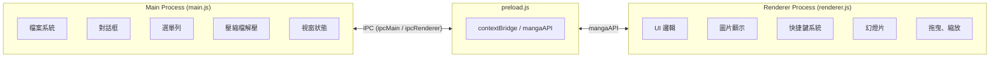
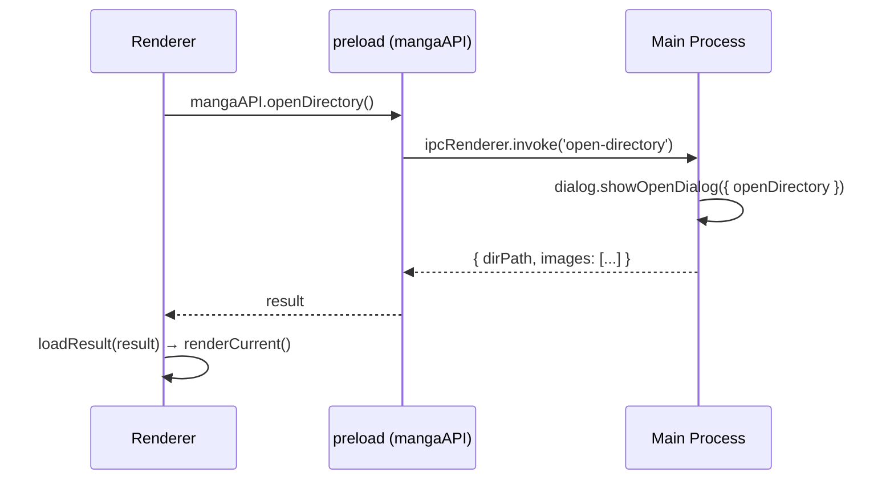
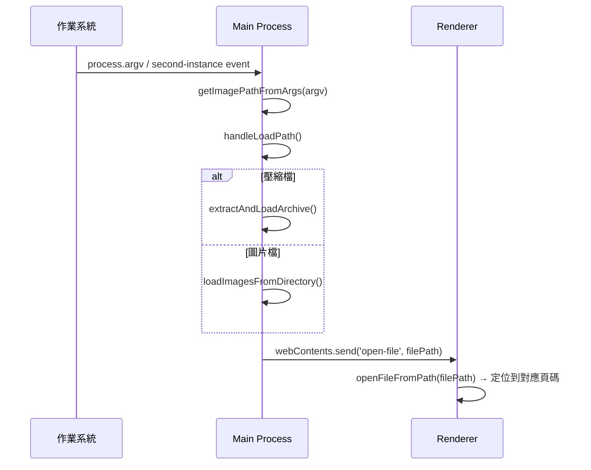

# AGENTS.md — Simple Manga Viewer 技術指南

> 本文件供 AI Agent 或開發者快速掌握專案技術架構，不涉及使用者操作說明（請見 `README.md`）。

## 技術棧

| 項目 | 技術 |
|------|------|
| 框架 | Electron 33+ |
| 語言 | JavaScript (ES2020+) |
| 前端 | 原生 HTML + CSS，無框架 |
| 壓縮檔處理 | adm-zip |
| 打包 | electron-builder 25+ (NSIS for Windows, DMG for macOS) |
| 程式碼簽署 | 略過（`build-scripts/skip-sign.js`） |

## 專案結構

```
simple-manga-viewer/
├── main.js                  # Electron 主程序 (Main Process)
├── preload.js               # Context Bridge / IPC 橋接
├── renderer.js              # 渲染程序 (Renderer Process) — 核心 UI 邏輯
├── index.html               # 應用程式 HTML 主頁面
├── styles.css               # 全域樣式
├── package.json             # 專案設定 & electron-builder 組態
├── icons/
│   └── icon.png             # 應用程式圖示
├── build/
│   └── installer.nsh        # NSIS 自訂安裝腳本 (FriendlyAppName)
├── build-scripts/
│   ├── afterPack.js         # electron-builder afterPack hook (rcedit)
│   └── skip-sign.js         # 略過程式碼簽署
├── dist/                    # 建置輸出 (.exe / .dmg)
└── .gitignore
```

## 架構概要

### Electron 程序模型



### Main Process (`main.js`)

**職責**：

- **視窗管理**：建立 `BrowserWindow`，持久化視窗尺寸 / 位置 (`window-state.json` 存於 `userData`)
- **單一實例鎖定**：`app.requestSingleInstanceLock()` 確保只有一個實例，第二實例的參數轉交第一實例
- **檔案系統操作**：讀取目錄、掃描圖片、過濾副檔名
- **壓縮檔處理**：使用 `adm-zip` 解壓 `.zip` / `.cbz` 至暫存目錄 (`app.getPath('temp')`)
- **應用程式選單**：檔案 → 開啟目錄、說明 → 關於
- **檔案關聯**：處理從檔案總管雙擊圖片 / 壓縮檔開啟

**關鍵函式**：

| 函式 | 說明 |
|------|------|
| `createWindow()` | 建立主視窗，載入視窗狀態，設定 CSP |
| `loadWindowState()` / `saveWindowState()` | 視窗位置尺寸持久化 |
| `getImagePathFromArgs(argv)` | 解析命令列參數中的圖片 / 壓縮檔路徑 |
| `handleLoadPath(targetPath)` | 判斷路徑為目錄或壓縮檔，分別處理 |
| `extractAndLoadArchive(archivePath)` | 解壓壓縮檔並回傳圖片列表 |
| `loadImagesFromDirectory(dirPath)` | 掃描目錄下的圖片，自然排序 |
| `clearTempDir()` | 清理暫存解壓目錄 |

### Preload (`preload.js`)

透過 `contextBridge.exposeInMainWorld('mangaAPI', {...})` 暴露以下 API 給渲染程序：

| API | IPC Channel | 說明 |
|-----|-------------|------|
| `mangaAPI.openDirectory()` | `open-directory` | 開啟目錄選擇對話框 |
| `mangaAPI.openArchive()` | `open-archive` | 開啟壓縮檔選擇對話框 |
| `mangaAPI.loadDirectory(dirPath)` | `load-directory` | 載入指定路徑的圖片 |
| `mangaAPI.getSubdirectories(dirPath)` | `get-subdirectories` | 取得子目錄和圖片列表 |
| `mangaAPI.getFileDirectory(filePath)` | `get-file-directory` | 取得檔案所在目錄 |
| `mangaAPI.getParentDirectory(dirPath)` | `get-parent-directory` | 取得父目錄 |
| `mangaAPI.getVersion()` | `get-version` | 取得 app 版本 |
| `mangaAPI.onOpenFile(callback)` | `open-file` (event) | 從檔案總管開啟圖片的事件 |
| `mangaAPI.onMenuOpenDirectory(callback)` | `menu-open-directory` (event) | 選單「開啟目錄」的事件 |

### Renderer Process (`renderer.js`)

**核心模組劃分**（以註解區塊分隔）：

1. **Key Bindings Configuration** — 快捷鍵定義與自訂
2. **Directory & Image Loading** — 載入目錄 / 壓縮檔圖片
3. **Rendering** — 圖片渲染引擎（單頁 / 雙頁 / Webtoon）
4. **Navigation** — 翻頁邏輯
5. **Hold-to-Pan** — 按住 WASD / 方向鍵持續平移
6. **Keyboard Shortcuts** — 鍵盤事件分發
7. **Helpers** — 縮放、幻燈片、全螢幕切換
8. **Toolbar Event Listeners** — 工具列互動
9. **Mouse Drag to Scroll** — 滑鼠拖曳捲動
10. **Sidebar Resizer** — 側邊欄寬度調整
11. **File Open from Explorer** — 從外部開啟圖片
12. **Help Modal / Keybind Settings Modal** — 快捷鍵說明 & 自訂設定

**應用狀態 (`state` 物件)**：

```javascript
const state = {
  images: [],              // 當前目錄的圖片路徑陣列
  currentPage: 0,          // 目前頁碼 (0-indexed)
  fitMode: 'fit-width',    // 'fit-width' | 'fit-height' | 'custom-width'
  customWidth: 800,        // 自訂寬度 (px)
  pageMode: 'single',      // 'single' | 'double' | 'webtoon'
  currentDirectory: null,  // 目前開啟的目錄路徑
  isDragging: false,       // 是否在拖曳模式
  dragStartX: 0,
  scrollStartX: 0,
  scrollStartY: 0,
};
```

**快捷鍵系統**：
- 預設快捷鍵定義在 `defaultKeyBindings` 物件
- 使用者自訂快捷鍵儲存於 `localStorage` (`manga-viewer-keybindings`)
- `loadKeyBindings()` / `saveKeyBindings()` 負責讀寫
- `rebuildPanKeys()` 在快捷鍵變更後重建平移按鍵集合

**圖片渲染流程**：
1. `renderCurrent()` → 判斷 `pageMode`，分發至 `renderPage()` 或 `renderWebtoon()`
2. `renderPage()` → 建立 `` 元素，設定 `onload` 回呼進行尺寸調整
3. `applyFitStyle(img, pageCount)` → 依 `fitMode` 套用 CSS 尺寸
4. `preloadNextImages()` → 預載接下來 3 張圖片加速瀏覽

**翻頁動畫**：
- 使用 CSS `opacity` 過渡 (`transition: opacity 0.15s`)
- 載入新圖片前顯示前一張模糊圖片作為佔位符，避免黑屏閃爍

**閱讀進度持久化**：
- 使用 `localStorage` 儲存各目錄的閱讀位置
- 鍵值格式：以目錄路徑為 key

## CSS 架構 (`styles.css`)

- 全域深色主題 (`#1e1e1e` 背景)
- 工具列固定於頂部 (`position: fixed`)
- 側邊欄與閱讀區使用 `flexbox` 佈局
- 側邊欄可拖曳調整寬度（`#sidebar-resizer`）
- Modal 使用 `position: fixed` + `z-index` 覆蓋層
- 響應式設計：工具列在小螢幕自動換行（`flex-wrap`）

## 建置 & 打包

### 開發模式
```bash
npm install    # 安裝依賴
npm start      # 啟動 Electron 開發模式
```

### 生產建置
```bash
npm run build:win   # Windows (NSIS 安裝程式)
npm run build:mac   # macOS (DMG)
npm run build       # 全平台
```

### 建置注意事項

1. **Windows 開發人員模式**：必須開啟，否則 electron-builder 無法建立 symlink
   - 設定 → 系統 → 開發人員 → 開發人員模式 → 開啟
2. **afterPack hook** (`build-scripts/afterPack.js`)：使用 `rcedit` 修改 exe 的檔案描述和版本資訊
3. **NSIS 自訂腳本** (`build/installer.nsh`)：設定 `FriendlyAppName` registry，影響 Windows 「開啟方式」清單顯示的名稱。解除安裝時清除此 registry
4. **檔案關聯**：在 `package.json` 的 `build.fileAssociations` 中設定，支援 jpg/jpeg/png/gif/bmp/webp/tiff/tif/avif
5. **程式碼簽署**：目前略過，使用 `build-scripts/skip-sign.js`

### 輸出
- Windows: `dist/Simple Manga Viewer Setup {version}.exe`
- macOS: `dist/Simple Manga Viewer-{version}.dmg`

## IPC 通訊流程

### 開啟目錄



### 從檔案總管開啟




## 開發慣例

- **語言**：UI 文字使用繁體中文，程式碼註解混用中英文
- **命名**：函式命名使用 camelCase，CSS class 使用 kebab-case
- **版本號**：遵循 SemVer，在 `package.json` 中管理
- **Commit**：使用 Conventional Commits (`feat:`, `fix:`, `chore:`)
- **單一實例**：應用程式只允許單一實例執行
- **安全性**：啟用 `contextIsolation`，透過 `preload.js` 橋接 IPC，不直接暴露 Node.js API
- **CSP**：`default-src 'self'; img-src 'self' file:; style-src 'self' 'unsafe-inline';`
- **工具列互動後自動失焦**：所有按鈕、下拉選單、輸入框在操作後呼叫 `.blur()` 防止快捷鍵誤觸

## 支援的檔案格式

| 類型 | 副檔名 |
|------|--------|
| 圖片 | `.jpg`, `.jpeg`, `.png`, `.gif`, `.bmp`, `.webp`, `.tiff`, `.tif`, `.avif` |
| 壓縮檔 | `.zip`, `.cbz` |

## 已知限制

- 壓縮檔解壓至系統暫存目錄，關閉應用時清除
- macOS 環境**尚未測試**，建置配置僅為預設設定，可能需要調整
- 程式碼未簽署，Windows 可能出現 SmartScreen 警告
- 大型壓縮檔解壓可能需要較長時間，目前無進度條顯示
